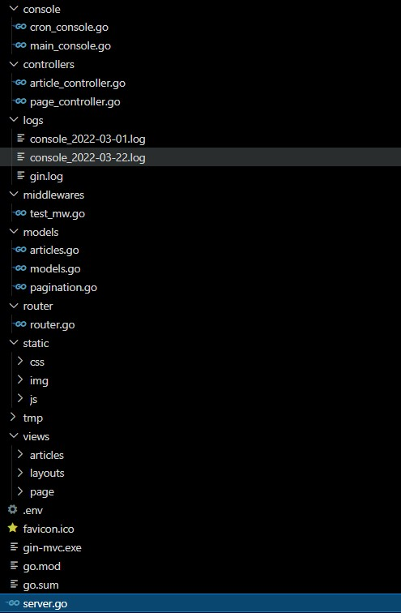

# Go GIN MVC Starter


Gin starter with MVC, ORM, template library, Bootstrap 5 and cronjob for Web and API. Build with package or module: GIN, GORM, GoDotEnv, Bootstrap 5, Goview, Cron.

For document check this url: https://gin-mvc-starter.herokuapp.com/

##

**Folders and files structure** 

https://gin-mvc-starter.herokuapp.com/structure



##

### Note

.env usage:
- rename .env-example to .env
- uncomment code in router/router.go & console/main_console.go
```
// # Uncomment this code to load .env file
// err := godotenv.Load()
// if err != nil {
// 	log.Fatal("Error loading .env file")
// }
```
